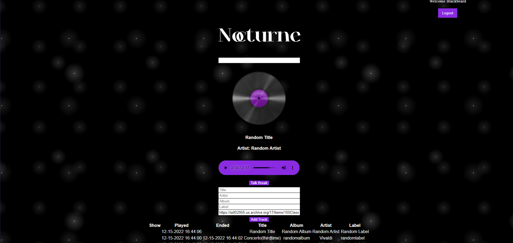

# Nocturne Radio

  ## Table-of-Contents
  - [Description](#description)
  - [Installation](#installation)
  - [License](#license)
  - [Usage](#usage)
  - [Contribution](#contributing)
  - [Questions](#questions)
  
  ## Description 
  Are you a small community radio station or intrested to starting your own station online? If you're based in the US you'll be required by law to keep a 
  log of all the songs you play. Thats where Nocturn Radio comes in! This app was designed so that you can easily keep a record of anything you play. So when "The
  Man" comes a knock'n you'll have your logs ready to avoid a heavy fine. 
  
  ## Installation 
  Once the site is hosted you'll be able to make an account. Once signed in you'll be able to log to your heart's content!
  
  ## License 
  [For more information about the license click here](https://choosealicense.com/licenses/mit/)
  
  ## Usage 
  There are four inputs to manually log song title, arist name, album name, and record label name. Once logged the information will be complied into a list
  below
  
  ## Contribution 
  This app was made possible by Ava Blake, Matthew Parker, and Jon Rushing
  
  ## Questions 
  If you have any questions at all feel free to contact here:
  
  [GitHub](https://github.com/avablakedesign)

 Deployment Link:
 
 https://nocturne-radio.herokuapp.com/home
 
  

 
